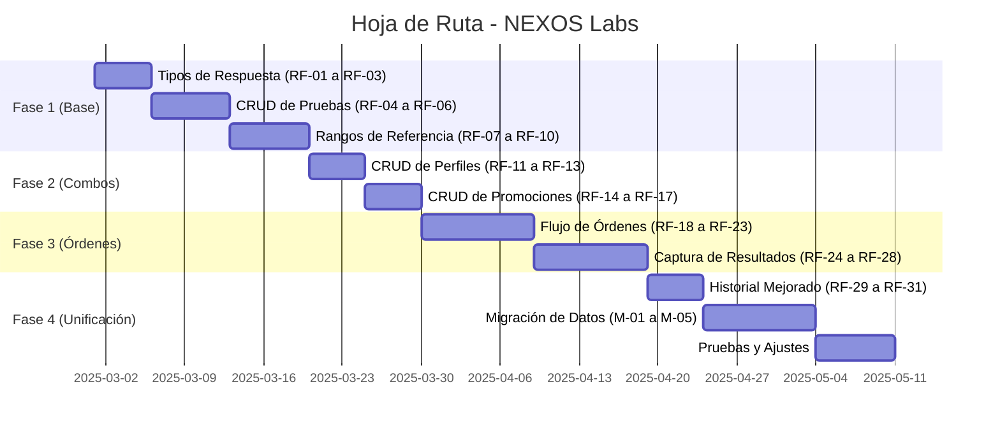

Perfecto. Aquí tienes el documento de requerimientos para **NEXOS Labs - Módulo de Configuración y Órdenes** en formato Markdown (.md), listo para que lo guardes en tu carpeta `/docs` y se lo entregues a tu programador.

---

```markdown
---
title: "NEXOS Labs - Módulo de Configuración y Órdenes"
version: "1.0"
date: "2025-02-26"
status: "Borrador"
author: "Product Team"
tags: ["lis", "laboratorio", "configuracion", "ordenes", "resultados"]
language: "es"
---

# 📄 NEXOS Labs - Módulo de Configuración y Órdenes

| **Versión** | 1.0 |
| :--- | :--- |
| **Fecha** | 26 de Febrero de 2025 |
| **Estado** | `Borrador` |
| **Propósito** | Definir el alcance y las funcionalidades para el módulo de configuración de pruebas, perfiles, promociones, órdenes de pacientes y captura de resultados en NEXOS Labs. |

---

## 📑 Tabla de Contenido

1. [Resumen Ejecutivo](#1-resumen-ejecutivo)
2. [Objetivos del Módulo](#2-objetivos-del-módulo)
3. [Arquitectura de Datos](#3-arquitectura-de-datos)
4. [Requerimientos Funcionales](#4-requerimientos-funcionales)
   - 4.1 [Gestión de Tipos de Respuesta](#41-gestión-de-tipos-de-respuesta-enums-dinámicos)
   - 4.2 [Gestión de Pruebas](#42-gestión-de-pruebas-test-definitions)
   - 4.3 [Gestión de Rangos de Referencia](#43-gestión-de-rangos-de-referencia)
   - 4.4 [Gestión de Perfiles](#44-gestión-de-perfiles-combos)
   - 4.5 [Gestión de Promociones](#45-gestión-de-promociones)
   - 4.6 [Flujo de Órdenes de Pacientes](#46-flujo-de-órdenes-de-pacientes)
   - 4.7 [Captura de Resultados](#47-captura-de-resultados)
   - 4.8 [Historial de Pacientes](#48-historial-de-pacientes-mejora-de-lo-existente)
5. [Consideraciones de Migración](#5-consideraciones-de-migración)
6. [Priorización Sugerida](#6-priorización-sugerida-para-el-desarrollo)
7. [Checklist de Validación MVP](#7-checklist-de-validación-del-mvp)
8. [Consideraciones Técnicas](#8-consideraciones-técnicas-adicionales)

---

## 1. 📌 Resumen Ejecutivo

NEXOS Labs actualmente gestiona resultados de laboratorio provenientes de:

- **Equipos automatizados:** Dymind DH36 (hemogramas), iChroma II (pruebas especiales)
- **Captura manual:** Exámenes de Orina y Heces (con interfaces específicas)
- **Historial de exámenes por paciente** (funcionalidad ya existente)

El sistema requiere evolucionar hacia una arquitectura más flexible y configurable que permita:

1. **Crear y gestionar dinámicamente** pruebas, perfiles y promociones
2. **Definir tipos de respuesta personalizados** (enums configurables)
3. **Establecer rangos de referencia** variables por edad y sexo
4. **Implementar un flujo completo de órdenes** que vincule pacientes, pruebas solicitadas y resultados
5. **Unificar la captura de resultados** con interfaces adaptables al tipo de prueba
6. **Preservar y migrar adecuadamente** los datos históricos existentes

El objetivo es transformar NEXOS Labs en un sistema integral de gestión laboratorial (LIS) que pueda adaptarse a las necesidades cambiantes del laboratorio sin requerir modificaciones de código.

---

## 2. 🎯 Objetivos del Módulo

| ID | Objetivo | Beneficio |
|:---|:---|:---|
| **O-01** | Permitir configuración dinámica de catálogo de servicios | El laboratorio puede ofrecer nuevas pruebas sin programación |
| **O-02** | Soportar múltiples tipos de resultados (numéricos, cualitativos, enums) | Flexibilidad para cualquier tipo de análisis clínico |
| **O-03** | Gestionar rangos de referencia por edad/sexo | Resultados clínicamente precisos y contextualizados |
| **O-04** | Implementar órdenes de paciente con seguimiento financiero | Control de producción y facturación |
| **O-05** | Unificar la captura de resultados en una interfaz adaptable | Experiencia consistente para el personal técnico |
| **O-06** | Preservar el historial de exámenes por paciente | Continuidad clínica y auditoría |

---

## 3. 🏗️ Arquitectura de Datos

### 3.1. Tablas Existentes que se Mantienen

| Tabla | Uso Actual |
|:---|:---|
| `patients` | Datos de pacientes |
| `doctors` | Datos de médicos referentes |
| `users` | Usuarios del sistema |
| `roles`, `permissions` | Control de acceso |

### 3.2. Tablas Existentes que se Modifican/Mejoran

| Tabla | Modificaciones Propuestas |
|:---|:---|
| `test_definitions` | Agregar campos: `category_id`, `response_type_id`, `unit`, `decimal_places`, `is_active`, `display_order` |
| `test_profiles` | Agregar campos: `valid_from`, `valid_to` (para promociones), `is_promotion` |
| `profile_tests` | Agregar campo: `display_order` (para secuencia en informes) |
| `laboratory_orders` | Fortalecer como entidad principal de facturación |
| `order_tests` | Vincular órdenes con pruebas específicas |

### 3.3. Tablas Nuevas a Crear

```sql
-- Tipos de respuesta dinámicos (enums configurables)
CREATE TABLE test_response_types (
    id SERIAL PRIMARY KEY,
    name VARCHAR(100) NOT NULL,
    description TEXT,
    created_at TIMESTAMP DEFAULT NOW()
);

-- Opciones para cada tipo de respuesta (valores del enum)
CREATE TABLE test_response_options (
    id SERIAL PRIMARY KEY,
    response_type_id INTEGER REFERENCES test_response_types(id) ON DELETE CASCADE,
    value VARCHAR(100) NOT NULL,
    display_order INTEGER NOT NULL,
    color VARCHAR(20),
    is_default BOOLEAN DEFAULT FALSE,
    UNIQUE(response_type_id, value)
);

-- Categorías de pruebas (Hematología, Química, Uroanálisis, etc.)
CREATE TABLE test_categories (
    id SERIAL PRIMARY KEY,
    name VARCHAR(100) NOT NULL,
    description TEXT,
    display_order INTEGER
);

-- Rangos de referencia (con soporte para edad/sexo)
CREATE TABLE test_reference_ranges (
    id SERIAL PRIMARY KEY,
    test_definition_id INTEGER REFERENCES test_definitions(id) ON DELETE CASCADE,
    gender VARCHAR(10) CHECK (gender IN ('M', 'F', 'ANY')) DEFAULT 'ANY',
    age_min_months INTEGER,
    age_max_months INTEGER,
    min_value NUMERIC,
    max_value NUMERIC,
    textual_range VARCHAR(255),
    interpretation VARCHAR(50),
    created_at TIMESTAMP DEFAULT NOW()
);

-- Promociones (combos especiales con vigencia)
CREATE TABLE promotions (
    id SERIAL PRIMARY KEY,
    name VARCHAR(200) NOT NULL,
    description TEXT,
    price DECIMAL(10,2) NOT NULL,
    valid_from DATE NOT NULL,
    valid_to DATE NOT NULL,
    is_active BOOLEAN DEFAULT TRUE,
    created_at TIMESTAMP DEFAULT NOW()
);

-- Relación promociones ↔ pruebas
CREATE TABLE promotion_tests (
    promotion_id INTEGER REFERENCES promotions(id) ON DELETE CASCADE,
    test_definition_id INTEGER REFERENCES test_definitions(id) ON DELETE CASCADE,
    PRIMARY KEY (promotion_id, test_definition_id)
);

-- Relación promociones ↔ perfiles
CREATE TABLE promotion_profiles (
    promotion_id INTEGER REFERENCES promotions(id) ON DELETE CASCADE,
    profile_id INTEGER REFERENCES test_profiles(id) ON DELETE CASCADE,
    PRIMARY KEY (promotion_id, profile_id)
);

-- Resultados unificados (para nuevos resultados)
CREATE TABLE unified_test_results (
    id SERIAL PRIMARY KEY,
    order_test_id INTEGER REFERENCES order_tests(id) ON DELETE CASCADE,
    test_definition_id INTEGER REFERENCES test_definitions(id),
    
    -- Para resultados numéricos
    numeric_value NUMERIC,
    
    -- Para resultados de enum
    response_option_id INTEGER REFERENCES test_response_options(id),
    
    -- Para resultados de texto
    text_value TEXT,
    
    -- Metadatos
    entered_by INTEGER REFERENCES users(id),
    entered_at TIMESTAMP DEFAULT NOW(),
    is_abnormal BOOLEAN,
    notes TEXT,
    
    -- Validación: solo uno de los tres tipos debe tener valor
    CONSTRAINT check_result_type CHECK (
        (numeric_value IS NOT NULL AND response_option_id IS NULL AND text_value IS NULL) OR
        (numeric_value IS NULL AND response_option_id IS NOT NULL AND text_value IS NULL) OR
        (numeric_value IS NULL AND response_option_id IS NULL AND text_value IS NOT NULL)
    )
);
```

---

## 4. ⚙️ Requerimientos Funcionales

### 4.1. Gestión de Tipos de Respuesta (Enums Dinámicos)

| ID | Requerimiento | Prioridad |
|:---|:---|:---|
| **RF-01** | **CRUD de Tipos de Respuesta.** El administrador puede crear, editar y eliminar tipos de respuesta. | `ALTA` |
| **RF-02** | **CRUD de Opciones de Respuesta.** Para cada tipo, el administrador puede agregar opciones con: valor, orden de visualización, color opcional y si es valor por defecto. | `ALTA` |
| **RF-03** | **Vista previa.** Al configurar un tipo, mostrar cómo se verá el dropdown en la captura de resultados. | `BAJA` |

**Ejemplo de tipos a migrar desde el código actual:**
- `DetectedNotDetected` (Detectado, No detectado)
- `EscasaModeradaAbundante` (Escasa, Moderada, Abundante)
- `NegativePositive3Plus` (Negativo, Positivo +, Positivo ++, Positivo +++)

**Interfaz sugerida:**
```
Tipos de Respuesta
+---------------------------------------------------+
| Nombre               | Opciones                   | Acciones |
|-----------------------+----------------------------+----------|
| Detectado/No detectado| Detectado, No detectado    | ✏️  🗑️   |
| Escala 3+             | Negativo, +, ++, +++      | ✏️  🗑️   |
+---------------------------------------------------+
[+ Nuevo Tipo de Respuesta]
```

---

### 4.2. Gestión de Pruebas (Test Definitions)

| ID | Requerimiento | Prioridad |
|:---|:---|:---|
| **RF-04** | **CRUD de Pruebas.** Crear pruebas con: nombre, categoría, precio, tipo de respuesta (numérico o enum configurable), unidad de medida, decimales (si numérico). | `ALTA` |
| **RF-05** | **Duplicar prueba.** Función para crear una nueva prueba basada en una existente. | `MEDIA` |
| **RF-06** | **Activar/Desactivar pruebas.** Poder desactivar una prueba sin eliminarla. | `MEDIA` |

**Interfaz sugerida:**
```
Nueva Prueba
+---------------------------------------------------+
| Nombre:           [ Trigliceridos                ] |
| Categoría:        [ Química Sanguínea    ▼       ] |
| Precio:           [ 15.00                        ] |
| Tipo de Resultado: [ ◎ Numérico  ○ Enum          ] |
|                   [ Unidad: mg/dL                 ] |
|                   [ Decimales: 2                  ] |
+---------------------------------------------------+
[ Guardar ] [ Cancelar ]
```

---

### 4.3. Gestión de Rangos de Referencia

| ID | Requerimiento | Prioridad |
|:---|:---|:---|
| **RF-07** | **Configuración de rangos por edad/sexo.** Para pruebas numéricas, permitir definir múltiples rangos según: sexo (M/F/ANY), rango de edad (en meses/años), valor mínimo y máximo. | `ALTA` |
| **RF-08** | **Validación de rangos.** Evitar rangos superpuestos para el mismo sexo y grupo etario. | `MEDIA` |
| **RF-09** | **Rangos textuales.** Para pruebas cualitativas, permitir definir qué valores se consideran "normales" vs "anormales". | `ALTA` |
| **RF-10** | **Vista de tabla de rangos.** Mostrar los rangos configurados en formato tabular. | `BAJA` |

**Interfaz sugerida:**
```
Rangos de Referencia: Trigliceridos
+---------------------------------------------------------------+
| Sexo | Edad Mínima | Edad Máxima | Mínimo | Máximo | Acciones |
|------|-------------|-------------|--------|--------|----------|
| ANY  | 0 años      | 9 años      | 0      | 75     | ✏️  🗑️   |
| ANY  | 10 años     | 19 años     | 0      | 90     | ✏️  🗑️   |
| M    | 20 años     |             | 40     | 160    | ✏️  🗑️   |
| F    | 20 años     |             | 35     | 150    | ✏️  🗑️   |
+---------------------------------------------------------------+
[+ Nuevo Rango]
```

---

### 4.4. Gestión de Perfiles (Combos)

| ID | Requerimiento | Prioridad |
|:---|:---|:---|
| **RF-11** | **CRUD de Perfiles.** Crear perfiles con: nombre, precio, descripción, y selección múltiple de pruebas que lo componen. | `ALTA` |
| **RF-12** | **Orden de pruebas.** Permitir definir el orden en que aparecerán las pruebas en el informe. | `MEDIA` |
| **RF-13** | **Vista de desglose.** Mostrar al crear el perfil: precio total si se compraran las pruebas por separado vs precio del perfil. | `BAJA` |

**Interfaz sugerida:**
```
Nuevo Perfil: Perfil Lipídico
+---------------------------------------------------+
| Nombre: [ Perfil Lipídico                       ] |
| Precio: [ 35.00                                  ] |
|                                                      |
| Pruebas disponibles:         | Pruebas en el perfil: |
|------------------------------|-----------------------|
| • Colesterol Total      +    | 1. Colesterol Total  ☰ |
| • Trigliceridos         +    | 2. Trigliceridos     ☰ |
| • HDL Colesterol        +    | 3. HDL Colesterol    ☰ |
| • LDL Colesterol        +    |                       |
| • Glucosa               +    |                       |
+---------------------------------------------------+
[ Guardar ] [ Cancelar ]
```

---

### 4.5. Gestión de Promociones

| ID | Requerimiento | Prioridad |
|:---|:---|:---|
| **RF-14** | **CRUD de Promociones.** Crear promociones con: nombre, precio, fechas de vigencia, y selección de pruebas y perfiles que incluye. | `ALTA` |
| **RF-15** | **Validación de fechas.** No permitir fechas de vigencia inválidas. | `MEDIA` |
| **RF-16** | **Activación automática.** Las promociones deben estar disponibles automáticamente en el rango de fechas configurado. | `ALTA` |
| **RF-17** | **Ejemplos precargados.** Incluir ejemplos: "Promoción Día del Padre", "Mes de la Madre". | `BAJA` |

**Interfaz sugerida:**
```
Nueva Promoción
+---------------------------------------------------+
| Nombre:     [ Promoción Día del Padre 2025      ] |
| Descripción: [ Exámenes de próstata y perfil lipídico ] |
| Precio:     [ 75.00                              ] |
| Vigencia:   [ 01/06/2025 ] al [ 30/06/2025     ] |
|                                                      |
| Incluir Pruebas:                                   |
| [✓] Antígeno Prostático                           |
| [✓] Perfil Lipídico                                |
| [ ] Testosterona                                   |
|                                                      |
| Ahorro: $60.00 vs $75.00                          |
+---------------------------------------------------+
[ Guardar ] [ Cancelar ]
```

---

### 4.6. Flujo de Órdenes de Pacientes

| ID | Requerimiento | Prioridad |
|:---|:---|:---|
| **RF-18** | **Crear orden desde paciente.** En el historial del paciente, agregar botón "Nueva Orden". | `ALTA` |
| **RF-19** | **Selector de items.** Al crear orden, permitir agregar: pruebas individuales, perfiles, promociones vigentes. Mostrar precios y total. | `ALTA` |
| **RF-20** | **Asignar médico.** Toda orden debe tener un médico referente. | `ALTA` |
| **RF-21** | **Número de muestra único.** Generar automáticamente un número de muestra único para la orden. | `ALTA` |
| **RF-22** | **Estados de orden.** Manejar estados: `Pendiente`, `Pagada`, `En Proceso`, `Completada`, `Facturada`. | `MEDIA` |
| **RF-23** | **Listado de órdenes.** Vista tipo dashboard con todas las órdenes, filtros por fecha, paciente, estado. | `MEDIA` |

**Interfaz sugerida:**
```
Nueva Orden para: Dilia Lorena Pérez Peña
+---------------------------------------------------+
| Médico:    [ John House                    ▼    ] |
|                                                      |
| Items disponibles:        | Items en la orden:      |
|---------------------------|-------------------------|
| 🔬 PRUEBAS                | 1. Perfil Lipídico   ☰  |
|   • Colesterol Total      |    $35.00               |
|   • Trigliceridos         | 2. Antígeno Prostático ☰|
|   • HDL Colesterol        |    $25.00               |
| 📋 PERFILES               |                         |
|   • Perfil Lipídico       |    Total: $60.00        |
| 🎁 PROMOCIONES            |                         |
|   • Día del Padre         |                         |
+---------------------------------------------------+
[Guardar Orden] [Imprimir Orden] [Cancelar]
```

---

### 4.7. Captura de Resultados

| ID | Requerimiento | Prioridad |
|:---|:---|:---|
| **RF-24** | **Lista de trabajo.** Vista de "Pendientes" donde el técnico ve las órdenes con pruebas pendientes de resultado. | `ALTA` |
| **RF-25** | **Interfaz adaptable.** Al seleccionar una prueba pendiente, mostrar interfaz según tipo: numérica (campo numérico), enum (dropdown), texto (área de texto). | `ALTA` |
| **RF-26** | **Cálculo automático de anormalidad.** Al ingresar un valor numérico, comparar automáticamente con rangos del paciente y marcar como anormal si corresponde. | `ALTA` |
| **RF-27** | **Captura por lote.** Para perfiles, mostrar todas las pruebas en una sola pantalla. | `MEDIA` |
| **RF-28** | **Resultados de equipos.** Mantener la recepción automática actual, asociándola a órdenes existentes por número de muestra. | `ALTA` |

**Interfaz sugerida:**
```
Captura de Resultados - Orden #ST251103001
Paciente: Dilia Lorena Pérez Peña (F, 34 años)
+---------------------------------------------------+
| Prueba               | Resultado        | Unidad | Estado |
|----------------------|------------------|--------|--------|
| 🔬 Perfil Lipídico    |                  |        |        |
|   • Colesterol Total | [ 210           ] | mg/dL | 🔴 Alto|
|   • Trigliceridos    | [ 150           ] | mg/dL | 🟢 Normal|
|   • HDL Colesterol   | [ 35            ] | mg/dL | 🔴 Bajo |
|                      |                  |        |        |
| 🔬 Antígeno Prostático| [ ▼ Negativo    ] |        | 🟢 Normal|
+---------------------------------------------------+
[Guardar Resultados] [Marcar como Completado]
```

---

### 4.8. Historial de Pacientes (Mejora de lo existente)

| ID | Requerimiento | Prioridad |
|:---|:---|:---|
| **RF-29** | **Vista unificada de historial.** Mostrar todos los exámenes realizados sin importar su origen (automático o manual). | `ALTA` |
| **RF-30** | **Filtros en historial.** Filtrar por rango de fechas, tipo de examen, estado. | `MEDIA` |
| **RF-31** | **Comparativa temporal.** Para pruebas numéricas, mostrar gráfica de evolución en el tiempo. | `BAJA` |

**Interfaz sugerida:**
```
Historial de Dilia Lorena Pérez Peña
+---------------------------------------------------------------+
| Fecha      | Examen               | Resultados                | Estado  |
|------------|----------------------|---------------------------|---------|
| 04/11/2025 | Examen General de    | Normal                     | ✅ Listo |
|            | Heces                |                           |         |
| 03/11/2025 | Examen General de    | Color: Amarillo           | ✅ Listo |
|            | Orina                | Leucocitos: No se observa |         |
| 15/10/2025 | Perfil Lipídico      | Colesterol: 210 (Alto)    | ✅ Listo |
|            |                      | Trigliceridos: 150        |         |
+---------------------------------------------------------------+
[Ver Gráfica de Colesterol] [Nueva Orden]
```

---

## 5. 🔄 Consideraciones de Migración

| ID | Requerimiento | Prioridad |
|:---|:---|:---|
| **M-01** | **Preservar datos históricos.** No eliminar tablas existentes hasta validación. | `ALTA` |
| **M-02** | **Migración de tipos de respuesta.** Crear en `test_response_types` los enums existentes en el código. | `ALTA` |
| **M-03** | **Migración de pruebas.** Identificar pruebas únicas de tablas existentes y crearlas en `test_definitions`. | `ALTA` |
| **M-04** | **Dualidad temporal.** El sistema debe poder mostrar resultados de tablas antiguas y nuevas durante transición. | `ALTA` |
| **M-05** | **Creación de órdenes históricas.** Generar órdenes para resultados existentes, agrupados por paciente y fecha. | `MEDIA` |

---

## 6. 🎯 Priorización Sugerida para el Desarrollo



---

## 7. ✅ Checklist de Validación del MVP

- [ ] **RF-01 a RF-03:** Puedo crear tipos de respuesta personalizados
- [ ] **RF-04 a RF-06:** Puedo crear una nueva prueba y asignarle tipo numérico o enum
- [ ] **RF-07 a RF-10:** Puedo configurar rangos de referencia por edad y sexo
- [ ] **RF-11 a RF-13:** Puedo crear un perfil que incluya varias pruebas
- [ ] **RF-14 a RF-17:** Puedo crear una promoción con fechas de vigencia
- [ ] **RF-18 a RF-23:** Puedo crear una orden para un paciente y agregar items
- [ ] **RF-24 a RF-28:** Puedo capturar resultados y se marcan anormales automáticamente
- [ ] **RF-29 a RF-31:** El historial del paciente muestra todos los exámenes unificados
- [ ] **M-01 a M-05:** Los datos históricos siguen visibles después de la migración

---

## 8. 💡 Consideraciones Técnicas Adicionales

| Área | Recomendación |
|:---|:---|
| **API** | Mantener parsers actuales, pero asociar resultados a `order_tests`. |
| **Frontend** | Extender pantallas existentes en lugar de reemplazar. |
| **Rendimiento** | Indexar `test_reference_ranges` por `test_definition_id`, `gender`, `age_min_months`. |
| **Seguridad** | Solo administradores pueden acceder a CRUDs de configuración. |
| **Auditoría** | Registrar cambios en tablas de configuración. |
| **Respuesta** | Para resultados de equipos, mapear código del equipo al ID de `test_definition`. |

---

## 9. 📝 Notas para el Programador

1. **Respetar la estructura actual** de `urine_tests` y `stool_tests` durante la migración
2. **Mantener funcional** el historial de pacientes existente mientras se construye el unificado
3. **Los enums del código actual** deben migrarse a la base de datos como tipos de respuesta
4. **El número de muestra** debe seguir el formato actual (ej: ST251103001)
5. **Las pantallas de captura** deben ser intuitivas y rápidas para el técnico

---

**Fin del Documento**
```
